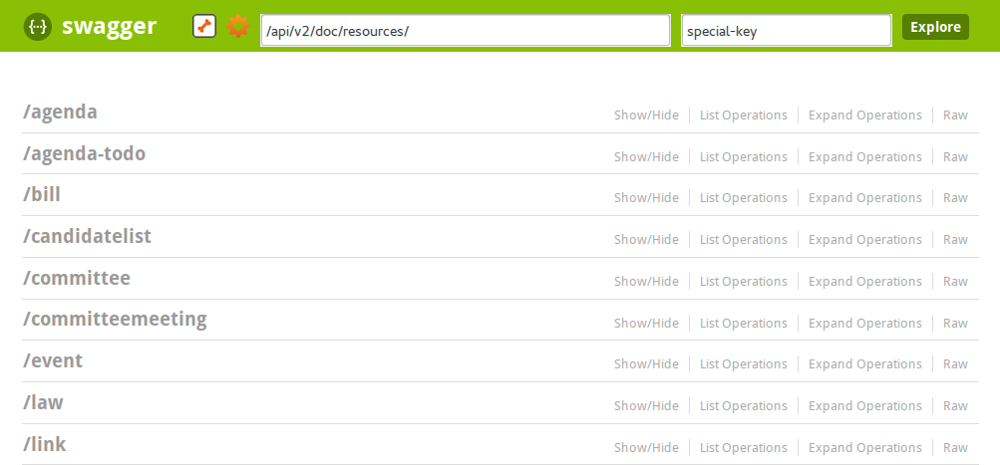
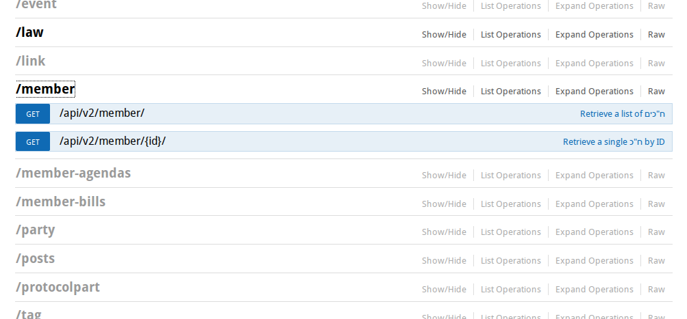
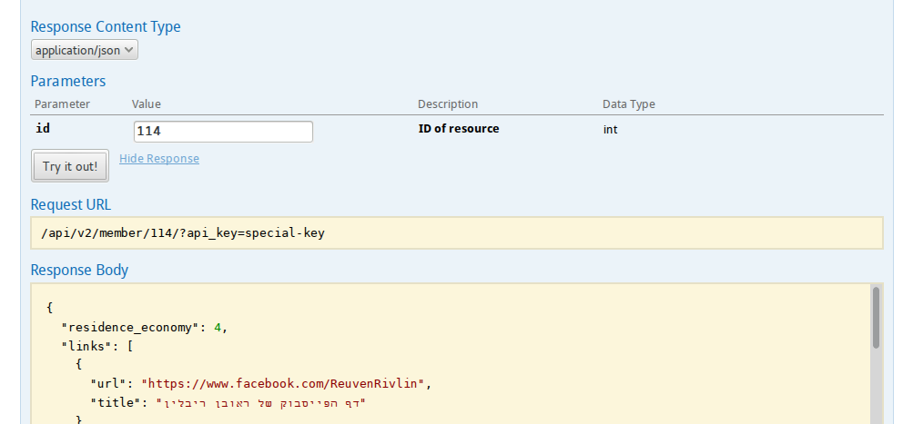

Swagger generated API documentation and interaction
====================================================

Access the swagger_ based API docs using https://oknesset.org/api/v2/doc/. It
enables browsing the API and call it passing parameters.

See the following screen shots for some examples:

    Swagger based api listing

    Member API expanded

    Get member API call

.. _swagger: http://swagger.io/
