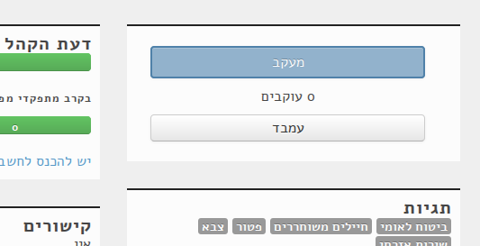

Embedding widgets
====================

Member
----------

To embed a Knesset member's card, use:

.. code-block:: html

    <iframe width="400" height="200" scrolling="no" style="border:0" src="https://oknesset.org/static/html/oknesset-iframe.html?id=member_id"></iframe>

Replace `member_id` with the id of the member from the url, e.g:

.. code-block:: html

    <iframe width="400" height="200" scrolling="no" style="border:0" src="https://oknesset.org/static/html/oknesset-iframe.html?id=114"></iframe>

.. raw:: html

    <iframe width="400" height="200" scrolling="no" style="border:0" src="https://oknesset.org/static/html/oknesset-iframe.html?id=114"></iframe>

You can get the embedding code for the member's page. For example visit
https://oknesset.org/member/114/ and click the `"עמבד"` button:

.. image:: ../_static/mk_embed.png

Bill
-------

To embed a bill information use:

.. code-block:: html

    <iframe frameborder="0" id="embed-widget" src="https://oknesset.org/bill/bill_id/embed/" style="width: 505px; height: 375px;"></iframe>

Replace `bill_id` with the id from the bill's url, e.g:

.. code-block:: html

    <iframe frameborder="0" id="embed-widget" src="https://oknesset.org/bill/8407/embed/" style="width: 505px; height: 375px;"></iframe>

.. raw:: html

    <iframe frameborder="0" id="embed-widget" src="https://oknesset.org/bill/8407/embed/" style="width: 505px; height: 375px;"></iframe>

You can get the embedding code from the bill's page. For the above example,
visit https://oknesset.org/bill/8407/ and click the `"עמבד"` button:

