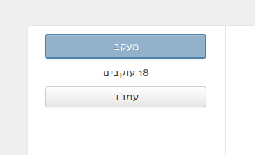

Embedding widgets
====================

Member
----------

To embed a Knesset member's card, use:

.. code-block:: html

    <iframe width="400" height="186" scrolling="no" style="border:0" src="https://oknesset.org/static/html/mk-iframe.html?id=[member_id]"></iframe>

Replace `member_id` with the id of the member from the url, e.g:

.. code-block:: html

    <iframe width="400" height="186" scrolling="no" style="border:0" src="https://oknesset.org/static/html/mk-iframe.html?id=885"></iframe>

You can get the embedding code for the member's page. For example visit
https://oknesset.org/member/885/, and click the `"עמבד"` button:

