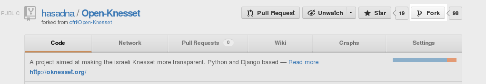

.. _github:

========================
GitHub and Source Code
========================

The Open Knesset code is hosted on GitHub, and uses ``git`` for distributed
version control.

Create a GitHub account
============================

If not done already, goto the `github's sign up`_, and create a user account.

Once done, login.

.. _github's sign up: https://github.com/users

Forking the Open Knesset project
===================================

Forking the project creates your personal repository of the source code. Goto to
the `Open Knesset repository`_ and fork the project.

.. _Open Knesset repository: https://github.com/hasadna/Open-Knesset

