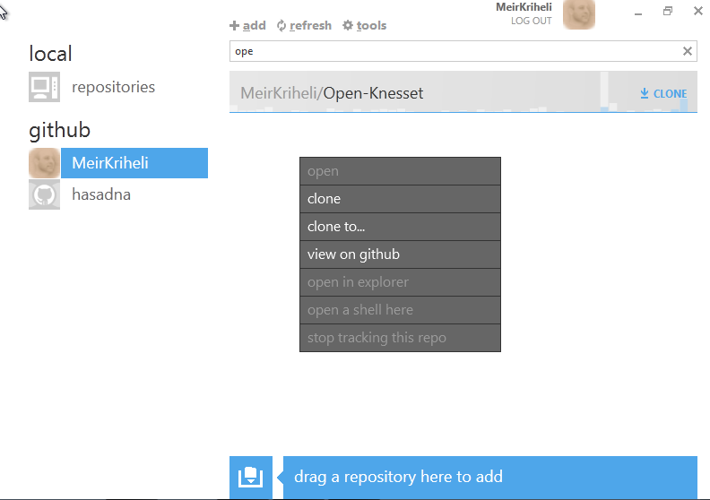
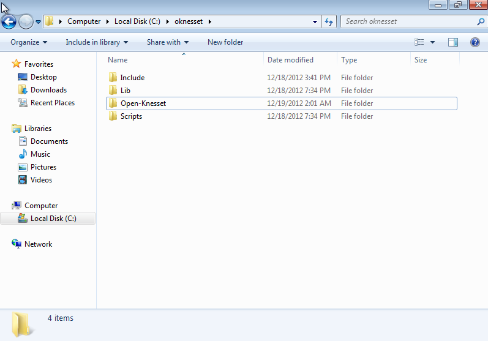

===================================
The Virtual Environment
===================================

.. important::

    Make sure the basic requirements are installed

The virtualenv will create a separated environment which required packages will
be installed into (without affecting Python's global `site-packages`).

This environment will be activated every time we'll be working on the code,
running the development server, etc.

Creating the virtualenv
=========================

Navigate in a terminal (or command window) to the directory you want the
environment created in (usually under your home directory). We'll name the
created environment ``oknesset``. 

Once in that directory:

Linux
------------

.. code-block:: sh

    virtualenv oknesset

.. warning::

    In case you have both Python 2 and 3 installed, please make sure the virtualenv
    is created with Python 2. If that's not the case, pass the correct python
    executable to the virtualenv command. e.g:

    .. code-block:: sh

        virtualenv -p python2 oknesset
    

MS Windows
------------

Since on MS Windows compiling is a lot harder, we'll instruct virtualenv to use
`site-packages` and pick up PIL and lxml we've installed with the requirements.
This is less pure, but we'll live with that.

In this example we'll create the virtualenv in t C:\

.. code-block:: sh

    cd c:\
    c:\Python27\Scripts\virtualenv --distribute --system-site-packages oknesset

Activating the virtualenv
=============================

We need to `activate` the virtual environment (it mainly modifies the paths so
that correct packages and bin directories will be found) each time we wish to
work on the code.

Linux
------

In Linux we'll source the activation script (to set env vars):

.. code-block:: sh

    cd oknesset/
    . bin/activate

Note the change prompt with includes the virtualenv's name.

MS Windows
----------

We'll run the activation script::

    cd oknesset
    Scripts\activate

Note the change prompt with includes the virtualenv's name.

Getting the Source Code (a.k.a Cloning)
=========================================

Now we'll clone the forked repository into the virutalenv.

Linux
-------

Make sure you're in the `oknesset` directory and run::

    git clone https://github.com/your-username/Open-Knesset.git

Replace `your-username` with the username you've registered at git hub.

.. note::

    You can also clone with ssh keys, in that case follow the
    `github guide on ssh keys`_. Once you've done that, you're clone command
    will look like::

        git@github.com:your-username/Open-Knesset.git

.. _github guide on ssh keys: https://help.github.com/articles/generating-ssh-keys#platform-linux

Proceed to :ref:`install_requirements`.

Windows
---------

Run the GitHub program (you should have an icon on the desktop), and sign in
with your username and password. This should also extract git.

Select your GitHub profile, right click your Open-Knesset fork and select
*clone to*:

Select the folder *c:\oknesset*. This should clone the Open-Knesset repo into
the virtualenv we've created. If anything went ok, You should have something
similar to this:

.. _install_requirements:

Installing requirements
=============================

In the terminal or command window activated, inside the *oknesset* directory,
run:

.. code-block:: sh

    pip install -r Open-Knesset/requirements.txt

For windows, this needs to be done from the *Git shell* which will provide the
git toolchain in the path (you should have an icon on the desktop), launch it, 
and::

    cd c:\oknesset
    Scripts/activate
    pip install -r Open-Knesset\requirements.txt
