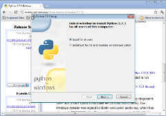
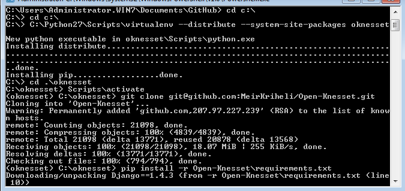

===========
MS Windows
===========

Installing Initial Requirements
=================================

On MS Windows the process is more manual. We'll start by downloading and
installing Python and some packages.

.. important::

    The documentation here assumes you'll accept defaults:

    - Python installed into ``C:\Python27``
    - Virtualenv will be created at ``C:\oknesset``

    If you've changed those, please adjust the instructions accordingly.

Python and packages
--------------------

Python
~~~~~~~~

    Python 2.7 install (click to enlarge)

`Download the latest Python 2.7`_ MSI installer matching your architecture
(32 or 64 bit). As of this writing, the latest one is `2.7.8`_.

.. _2.7.8: http://www.python.org/download/releases/2.7.8/
.. _Download the latest Python 2.7: http://python.org/download/releases/

Once downloaded, run the installer, and accept defaults.

.. important::

    The documentation assumes you've installed to the default ``C:\Python27``. If
    it's not the case, please adjust accordingly.

distribute
~~~~~~~~~~~~~~~

distribute replaces setuptools and makes our windows install simpler (as
setuptools for python2.7 on windows has problems on 64bit platforms and needs a
different installation method).

Download the `distribute setup script`_ and run it, either automatically
via your browser, by double-clicking it in windows explorer or
manually by running::

    python \path\to\the\download\directory\distribute_setup.py

.. _distribute setup script: http://python-distribute.org/distribute_setup.py

pip and virtualenv
~~~~~~~~~~~~~~~~~~~~~~

We'll install them with distribute. Open a command window, and::

    cd c:\Python27\Scripts
    easy_install pip
    pip install virtualenv

Pillow, lxml and ujson
~~~~~~~~~~~~~~~~~~~~~~~~

Since compiling those packages (inside the virtualenv) is not an easy task,
we'll install them separately and instruct virtualenv to use python's
global site-packages (not pure, but will make things easier for MS
Windows developers).

* Download and run the exe installer matching your architecture for `lxml`_
  (version 2.3.x)

.. _lxml: https://pypi.python.org/pypi/lxml/2.3

* Install `Pillow` with easy_install by running::

    easy_install Pillow==2.4.0

* Download and run the exe install matching you architecture for ujson_.

.. _ujson: http://www.lfd.uci.edu/~gohlke/pythonlibs/#ujson

git and GitHub tools
=======================

.. figure:: t_github_tools_win.png
    :alt: GitHub tools installer
    :align: right
    :target: ../_static/github_tools_win.png

    GitHub tools install (click to enlarge)

The Open Knesset code is hosted on GitHub, and uses ``git`` for distributed
version control. The easiest way to install them on windows is with
`GitHub for Windows`_ (download from the top right corner).

Run the installer, it'll start and download the rest of the needed packages:

.. _GitHub for Windows: http://windows.github.com

Run the GitHub program (you should have an icon on the desktop), and sign in
with your username and password. This should also extract git, and create a ssh
key and upload the public part to GitHub.

Creating and Activating the virtualenv
===========================================

From the desktop (or programs menu) run `Git Shell` |gitshell|, it's a shell
with git already configured, in the shell::

    cd C:\
    C:\Python27\Scripts\virtualenv --distribute --system-site-packages oknesset

.. note::
    If this command fails:

    * You probably have an older virtualenv installed.
      The quickest work-around is to replace it with the latest version::

          cd C:\Python27\Lib\site-packages
          del .\virtualenv*
          ..\..\Scripts\easy_install.exe virtualenv

    * Another problem may be that you had PYTHONPATH environment variable
      configured, in that case, unset it.

We need to `activate` the virtual environment (it mainly modifies the paths so
that correct `Lib` and `Scripts` directories will be found) each time we wish to
work on the code. ::

    cd oknesset
    Scripts\activate

Note the changed prompt with includes the virtualenv's name.

.. |gitshell| image:: git_shell_icon.png

Getting the Source Code (a.k.a Cloning)
=========================================

First, we need to fork the `Open-Knesset repository`_ on github.

Now we'll clone the forked repository into the virutalenv.  Make sure you're in
the `oknesset` directory and run::

    git clone git@github.com:your-name/Open-Knesset.git

Replace `your-username` with the username you've registered at git hub.

.. _Open-Knesset repository: https://github.com/hasadna/Open-Knesset

Installing requirements
=============================

In the Git Shell command window, with the virtualenv activated,
inside the *oknesset* directory, run:

.. code-block:: sh

    pip install -r Open-Knesset/requirements.txt

And wait ... See an example in the following screenshot:

Once done, proceed to :ref:`tests_develdb`.
