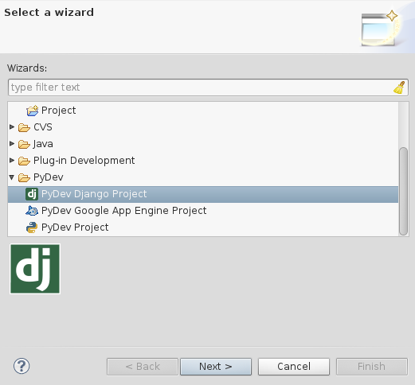
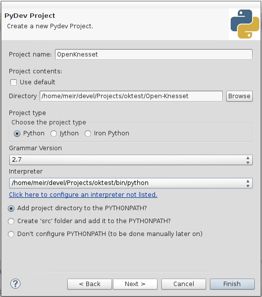
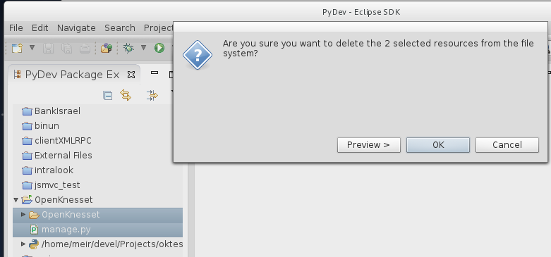

===============
IDE setup
===============

Basically you should lookup for virtualenv configuration of your preferred
development environment.

Eclipse with PyDev
======================

Start by creating a new PyDev Django Project:

* Type a name for the project --- e,g ``OpenKnesset``.
* Check "Use default" if unchecked.
* Click the link named "Click here to configure an interpreter not listed".

  In the opened window, click "New", and in the opened window "browse". Navigate
  to your virtualenv and select the `python` executable in your `Scripts` folder
  (for MS Windows) or `bin` (on Linux). 

  .. image:: pydev_interpreter.png

  Click "OK". A window will popup with folders to be added to python path, click
  "OK". If you get a warning click "Proceed anyways". Let it process the
  libraries and click "OK".

  Now you're back in the Project's dialog.
  Select the interpreter you've just added.
* Make sure "Don't configure PYTHONPATH" is selected, we'll handle it later.

You should have something like:

* Click "Next". In the "Reference Page" click "Next" again.
* Ignore everything you have in  "Django Settings" page and click "Finish".

Now you should have the project in the PyDev Package explorer (left side). In
the project, delete the "OpenKnesset" folder and  "manage.py":

Let's add our project source code:

* Right click the project in the Package explorer, select "New" and "Folder".
* Click "Advanced", and select "Link to alternate location".
* Click "Browse", navigate and select the "Open-Knesset" folder you've cloned
  earlier.
* Click "Finish".

The folder is added (and linked). Now it's to configure the django project to
use it:

* Right click the project and select "Properties".
* Select "PyDev - PYTHONPATH" and click "Add source folder".
* Select the **Open-Knesset** directory (expand the project if needed) and
  "Apply".
* Select "PyDev - Django"
* In "Django manage.py" enter "Open-Knesset/manage.py"
* In "Django settings module" enter "knesset.settings"

